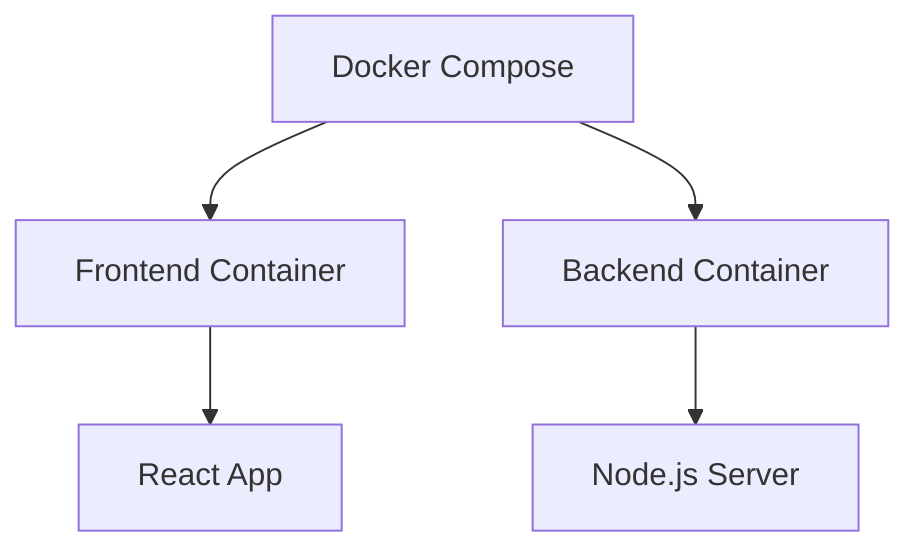

# Task D



## Build and Run the container

```bash
docker-compose up --build
```

## Getting Started

Each task has its own directory with specific instructions and configurations. Navigate to each task's directory to find detailed documentation and implementation steps.

## Prerequisites

- Docker installed on your system
- Basic understanding of containerization concepts
- Node.js (for Task C and D)
- Docker Compose (for Task D)

## Usage

Each task directory contains:

- A Dockerfile or docker-compose.yml
- Necessary source code
- Specific README with detailed instructions

To run any task, navigate to its directory and follow the instructions in the task-specific README.

## Contributing

Feel free to submit issues and enhancement requests.

## License

[MIT License](LICENSE)
